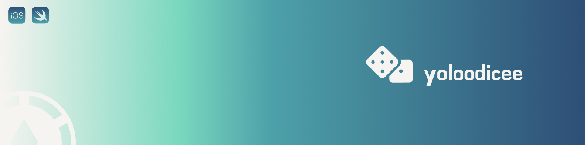

# Dice Roller App for iOS 18

## Goal

The objective of this project is to explore core programming concepts in Swift and iOS development using `Xcode 16.2` and iOS 18 SDK. This app will help reinforce fundamental coding principles while building a fully functional dice roller application.

## What you will create

We’re developing a `Las Vegas-style` dice roller app for iPhone running iOS 18. The app allows users to roll the dice either by pressing a button or by shaking their device. With this app, you’ll always have a fair way to settle any dispute on the go!

## Features

- Roll dice with a button press
- Roll dice by shaking the device
- Smooth animations for rolling dice
- Clean and modern UI following iOS 18 design guidelines

## Getting Started

To run this project on your local machine, follow these steps:

1. Clone the repository:

```bash
git clone https://github.com/yolookings/swiftproject-Dicee-iOS18.git
```

2. Open the project in `Xcode` 16.2 or later.

3. Ensure you have an iOS 18 simulator or a compatible iPhone running `iOS 18`.

4. Build and run the project using `Command + R`.

## Reference

This project was created with references from :

- <a href="https://github.com/appbrewery/Dicee-iOS13" target="_blank">appbrewery/Dicee-iOS13</a>

## License

This project is developed for educational purposes. Feel free to use and modify it as needed.

**` yolookings`** ~

<p align="center">
  
</p>

<p align="center">`_just a gimmick to be funny_ ~`</p>
